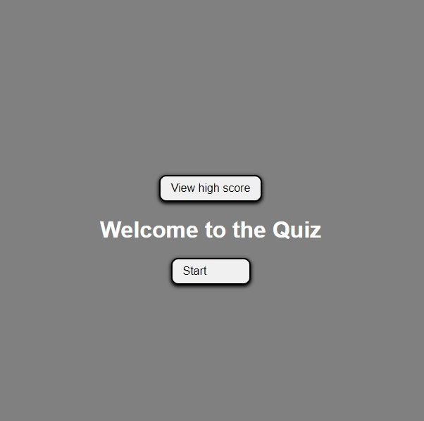

# 03 JavaScript: Random Password Generator

## This is an assignment is made with JavaScript and Web-API ❤️.



## Description

Github:
https://github.com/roflmelon/utor-assignment4

Live Link: https://roflmelon.github.io/utor-assignment4/

## Installation

N/A

## Usage

```
Click start to begin the quiz.
Answer the randomized questions.
If answer is wrong, subtract 5 seconds from the clock.
If answer is right, get the next question.
Game is finished when clock runs down or all questions have been answered.
After game is ends, players will input name to record their highscore in the localStorage.
Then highscores will be shown and main menu button will appear to guide player back to the main screen.
```

## Contributing

Hao Zhou and friends

## License

[MIT](https://choosealicense.com/licenses/mit/)
